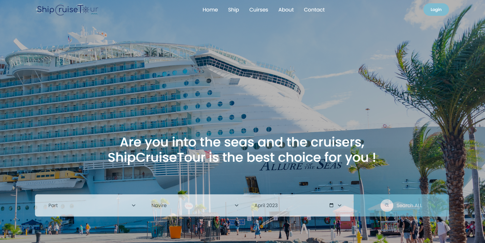
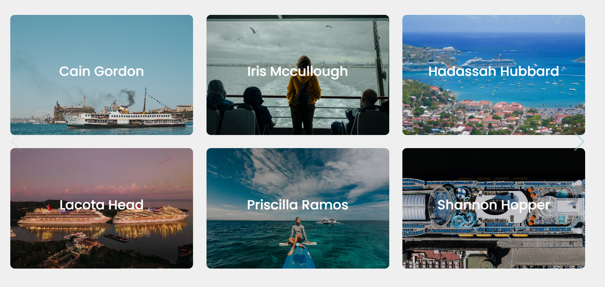
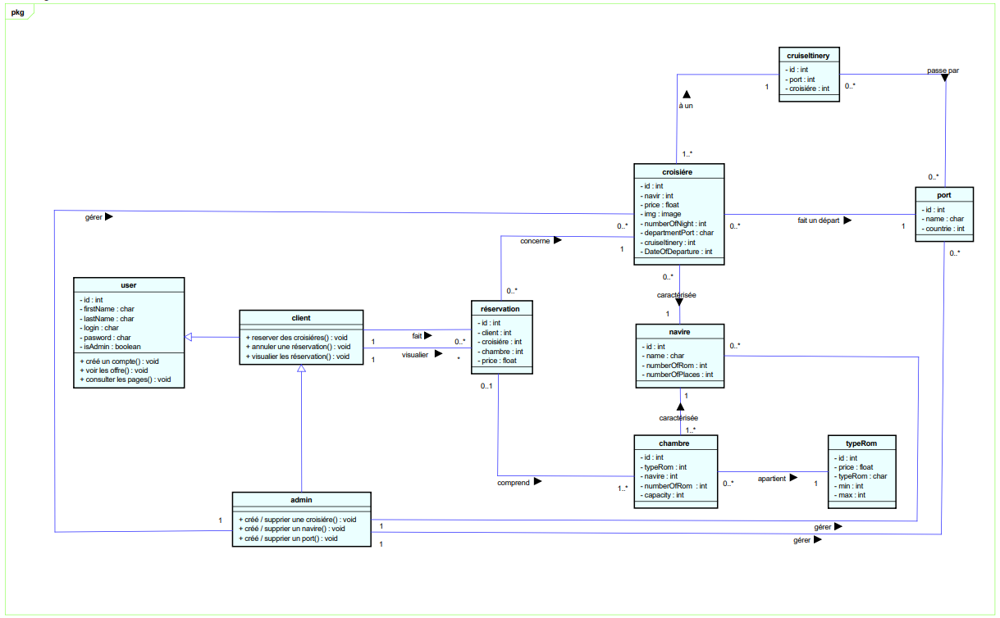
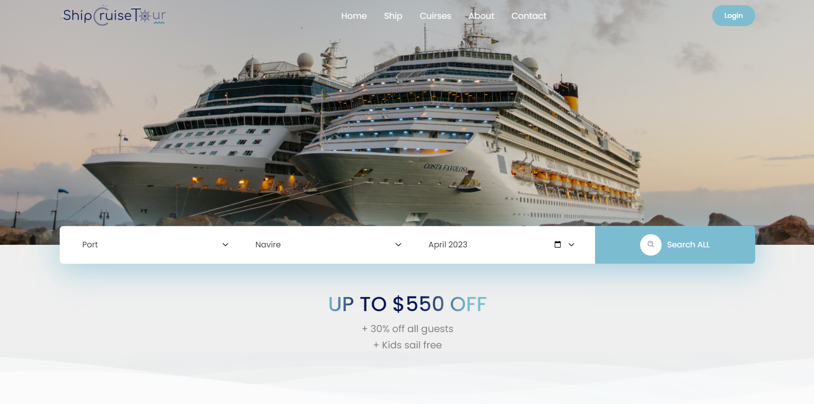
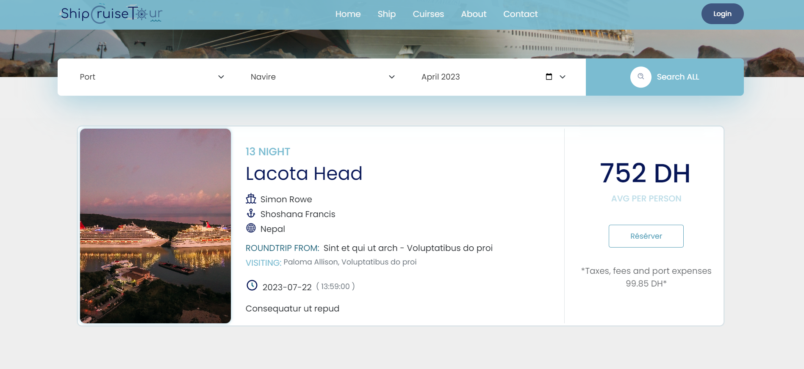
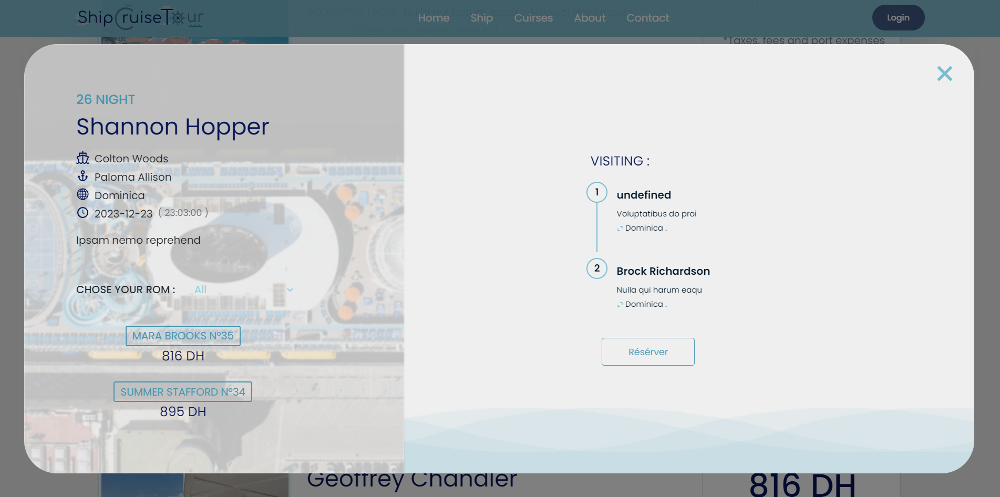
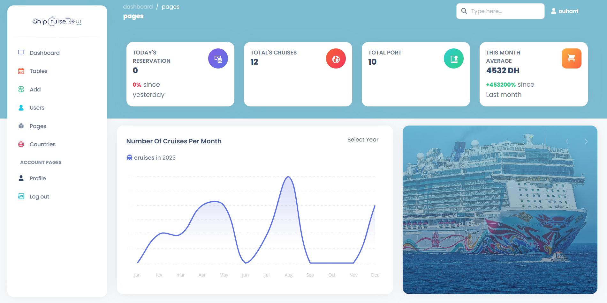
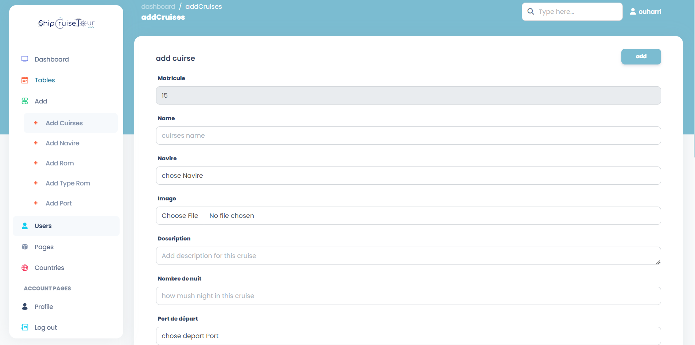

# ShipCruiseTour

Context of the project
You are required to build a full stack website for the company ShipCruiseTour which will increase their notoriety in the
market, for this purpose, you must follow the following instructions.

​

Criteria:

​

Authentication of the application by two roles (Admin, Client).

A Client / admin is characterized by (Name, first name, email, password, role)

A cruise is characterized by (the ship, price [min], image, number of nights, port of departure, cruise
itinerary [port1, port 2, port 3], date of departure)

A port is characterized by its name and country.

A ship is characterized by (name, number of rooms, number of seats).

A room is characterized by (ship, room number, type of
room [solo room, room for 2 people, family room more than 2 people and less than 6], price (depending on the type of
room), capacity according to the type of room )

A reservation is characterized by (customer, cruise, ++reservation date++, ++reservation price++, room).

A reservation concerns a single cruise and a single client.

A client can book multiple cruises.

A customer can cancel a reservation provided that the date is more than 2 days before the departure date of the cruise.

A customer can view all of these reservations.

An admin can create or delete a cruise.

An admin can create or delete a ship.

An admin can create or delete a port.

A complete cruise does not appear in the search.

The default search displays all available cruises with a valid departure date (greater than the current date).

By default the cruise selection is pointed to the minimum price and room type appropriate to the price.

The filtering of the search for a cruise is done by: Port , Vessel , Month

The filtering of after the selection of a cruise is done by: type of room

​

Technological constraints:

​

For Backend development, use technologies (PHP, OOP, Mysql) while respecting the MVC design pattern.

For Frontend development (Html, css frameworks, js, sass (optional)), choose the css framework that you know best.

Validation of fields as well as pagination in the application must be carried out with the Javascript language.

​

Bonuses:

​

Ticket printing.

Display of statistics (total number of cruises, number of cruises per month, total customers, number of countries,
graphic charter (port/cruise) ...) in the admin area.

​

